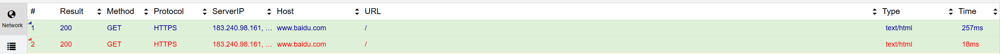
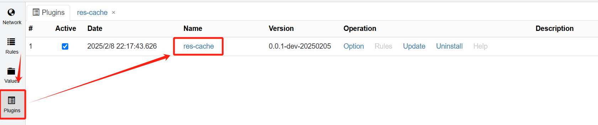
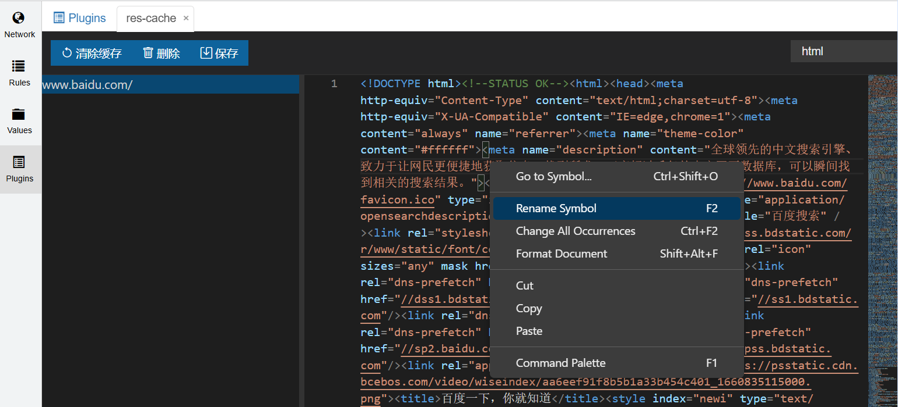

# whistle.res-cache 缓存插件

## 简介

whistle.res-cache 是一款 Whistle 插件，支持缓存接口数据并直接返回。开发者可以浏览和编辑缓存数据，轻松进行数据的 Mock 和修改。

## 主要功能

- 接口数据缓存：将匹配的请求的响应数据进行缓存，后续请求直接返回缓存内容。
- 自动更新缓存：缓存数据过期后自动更新，无需手动操作。
- 可视化编辑：通过插件页面浏览和编辑缓存内容。
- 多格式支持：支持 `HTML`、`CSS`、`JavaScript`、`JSON`、图片（以 Base64 形式返回）等数据格式。

## 安装

使用 npm 全局安装

```sh
npm install -g whistle.res-cache
```

## 使用

在 whistle 规则中新增以下内容。

```sh
/baidu.com/ res-cache://time=500000
```

**规则说明**

- 该规则会匹配路径中包含 `baidu.com` 的请求。
- `time=500000` 表示缓存数据的有效期为 500,000 秒，过期后会自动更新缓存。



**缓存前后对比**

- 首次请求：耗时约 257ms。
- 缓存后请求：耗时约 18ms。

## 插件界面

【插件页面入口如下】



在插件页面可以查看和编辑缓存的内容，编辑器使用 Monaco Editor，与 Visual Studio Code 操作一致，提供良好的编辑体验。


